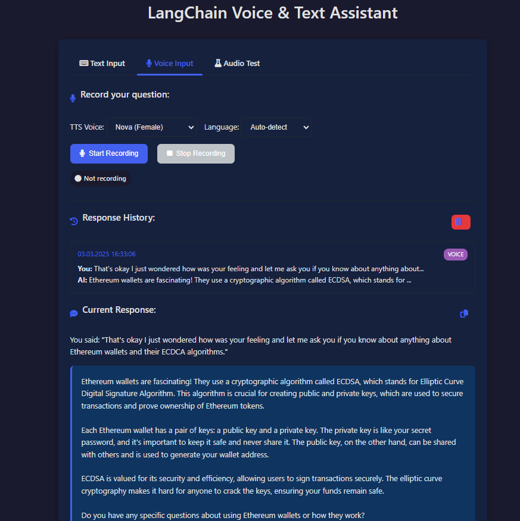

# LangChain Voice & Text Assistant

An advanced voice and text-based assistant using LangChain.js v3 and OpenAI models. This application provides a seamless conversational experience with both text and voice input/output capabilities.


## Features

- 🔊 **Voice Input & Output** - Speak to the assistant and hear responses
- ⌨️ **Text Chat Interface** - Traditional text-based conversation
- 🌐 **Multi-language Support** - Detects and responds in multiple languages
- 🎭 **Multiple Voice Options** - Choose from 6 different TTS voices
- 🌓 **Dark/Light Mode** - Toggle between themes for comfortable use
- 📱 **Responsive Design** - Works on desktop and mobile devices
- 📊 **Audio Visualization** - See voice inputs as waveforms
- 🧪 **Audio Testing Tools** - Verify your microphone and audio setup
- 📜 **Conversation History** - Access previous interactions
- ⌨️ **Keyboard Shortcuts** - Streamlined interactions for power users
- 🔄 **Real-time Updates** - See processing status as it happens
- 📝 **Copy to Clipboard** - Easily save assistant responses
- 🔍 **Debugging Tools** - Helpful diagnostics for troubleshooting

## Technical Highlights

- 🔧 **LangChain.js v3** - Latest conversation chains and memory management
- 🤖 **OpenAI GPT-4o** - State-of-the-art language model
- 🎤 **Whisper API** - Advanced speech-to-text capabilities
- 🔊 **TTS-1 Model** - High-quality text-to-speech
- 📦 **Socket.IO** - Real-time communication between client and server
- 🪵 **Winston Logging** - Comprehensive server-side logging
- 🧩 **Zod Validation** - Type-safe environment and input validation
- 🎬 **FFmpeg Integration** - Audio format conversion for maximum compatibility
- 🛡️ **Error Handling** - Robust error management and user feedback

## Setup

### Prerequisites

- Node.js v18 or higher
- OpenAI API key with access to:
  - GPT-4o/GPT-4 for text processing
  - Whisper for audio transcription
  - TTS-1 for text-to-speech conversion

### Installation

1. Clone this repository
   ```
   git clone https://github.com/yourusername/langchain-voice-assistant.git
   cd langchain-voice-assistant
   ```

2. Install dependencies
   ```
   npm install
   ```

3. Create a .env file with your OpenAI API key
   ```
   OPENAI_API_KEY=your_api_key_here
   PORT=3000
   ```

4. Start the server
   ```
   npm start
   ```

5. Open http://localhost:3000 in your browser

## Usage Guide

### Text Input
1. Type your question in the text area
2. Click "Send" or press Ctrl+Enter
3. View the assistant's response in text form

### Voice Input
1. Select your preferred voice and language options
2. Click "Start Recording" or press Ctrl+R
3. Speak your question clearly
4. Click "Stop Recording" or press Ctrl+R again
5. The assistant will transcribe your speech, process it, and respond in both text and audio formats

### Testing Audio
1. Use the "Audio Test" tab to verify your microphone works with the Whisper API
2. Record a test sample or upload an audio file
3. Check if the transcription is accurate

### Keyboard Shortcuts
- **Ctrl+Enter**: Send text message
- **Ctrl+R**: Start/stop recording
- **Escape**: Clear input
- **Ctrl+D**: Toggle dark/light mode




## Troubleshooting

If you encounter issues with audio processing:

1. **Check browser permissions** - Ensure your browser has permission to access your microphone
2. **Try different browsers** - Chrome and Edge generally offer the best WebRTC support
3. **Use the Audio Test tab** - Verify your setup with the dedicated testing function
4. **Check console logs** - Open developer tools to see detailed error messages
5. **Verify API key** - Ensure your OpenAI API key has access to required models
6. **Check server logs** - Review error.log and combined.log files
7. **Use FFmpeg** - Install FFmpeg locally for better audio conversion

## Contributing

Contributions are welcome! Please feel free to submit a Pull Request.

1. Fork the repository
2. Create your feature branch (`git checkout -b feature/amazing-feature`)
3. Commit your changes (`git commit -m 'Add some amazing feature'`)
4. Push to the branch (`git push origin feature/amazing-feature`)
5. Open a Pull Request

## License

Distributed under the MIT License. See `LICENSE` for more information.

## Acknowledgements

- [LangChain.js](https://js.langchain.com/)
- [OpenAI](https://openai.com/)
- [Socket.IO](https://socket.io/)
- [Express](https://expressjs.com/)
- [FFmpeg](https://ffmpeg.org/)